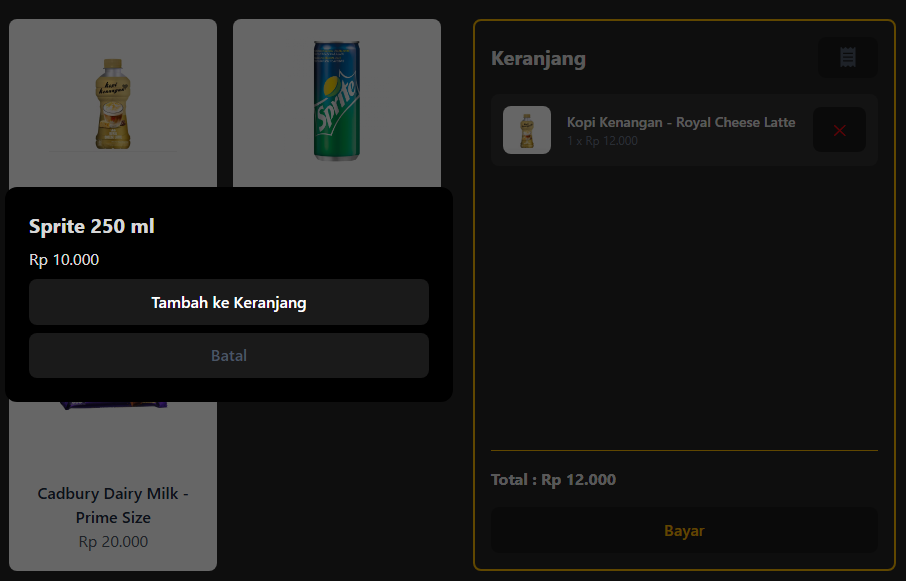
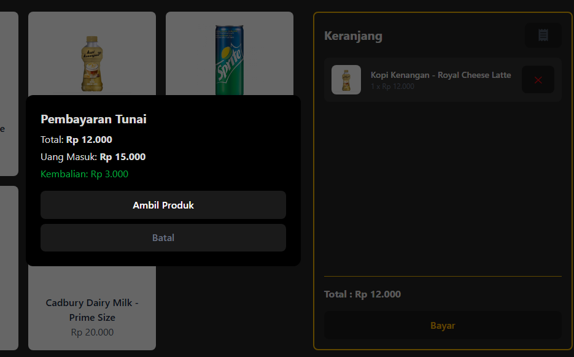
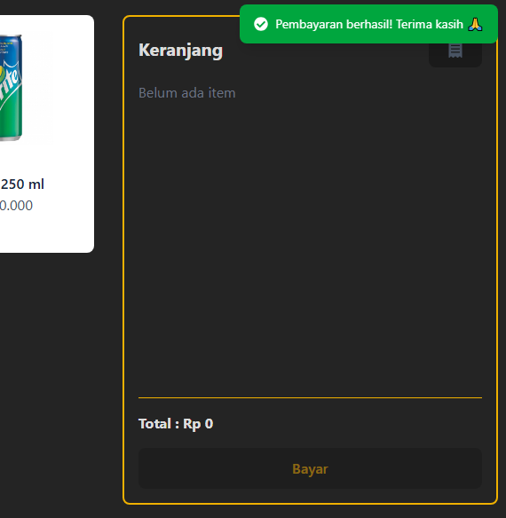
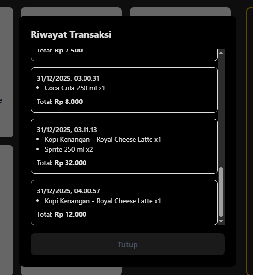

# 🥤 Vending Machine SPA

**Vending Machine SPA** adalah aplikasi simulasi mesin penjual otomatis berbasis web yang dibangun sebagai **Single Page Application (SPA)**. Aplikasi ini mensimulasikan alur nyata vending machine, mulai dari pemilihan produk, pengelolaan keranjang, pembayaran tunai (cash), hingga pencatatan riwayat transaksi.

Project ini dirancang dengan arsitektur modern menggunakan **React + TypeScript**, state management **Redux Toolkit**, styling **Tailwind CSS**, serta **JSON Server** sebagai mock backend untuk simulasi API dan penyimpanan data.

---

## ✨ Fitur Utama

- 🧃 **Daftar Produk**
  - Menampilkan produk dengan harga dan stok
  - Produk tidak dapat dibeli jika stok habis

- 🛒 **Keranjang Belanja (Cart Panel)**
  - Tampil di kolom terpisah dalam halaman yang sama
  - Update jumlah item secara real-time

- 💵 **Simulasi Pembayaran Cash**
  - Input uang menggunakan tombol pecahan:
    - Rp2.000
    - Rp5.000
    - Rp10.000
    - Rp20.000
    - Rp50.000
  - Validasi uang cukup & perhitungan kembalian

- 🔔 **Toast Notification**
  - Notifikasi sukses, warning, dan error
  - Warna toast dapat dikustom
  - Auto dismiss tanpa reload halaman

- 🧾 **Riwayat Transaksi**
  - Ditampilkan dalam modal dialog
  - Berisi detail item, total, dan waktu transaksi
  - Data transaksi disimpan ke `db.json`

- 📦 **Manajemen Stok**
  - Stok otomatis berkurang setelah transaksi berhasil
  - Proteksi jika stok habis

---

## 🧱 Teknologi yang Digunakan

### Frontend
- React (Vite)
- TypeScript
- Redux Toolkit
- Tailwind CSS
- React Icons (Font Awesome)

### Backend (Mock API)
- JSON Server

---

## 🏗️ Arsitektur Aplikasi

- Single Page Application (SPA)
- Tidak menggunakan routing halaman
- Semua interaksi (detail produk, pembayaran, riwayat transaksi) ditampilkan dalam **modal dialog**
- State global dikelola menggunakan Redux
- UI berbasis komponen yang reusable

---

## 🎯 Tujuan Project

Project ini dibuat untuk:

- Mensimulasikan alur vending machine dunia nyata
- Menerapkan best practice React + Redux
- Menjadi portfolio project Frontend / Fullstack Developer
- Melatih pembuatan aplikasi kiosk-style tanpa routing kompleks

---

## ⚙️ Instalasi & Menjalankan Aplikasi

### 1️⃣ Clone Repository
```bash
git clone https://github.com/username/vending-machine-spa.git
cd vending-machine-spa
```

### 2️⃣ Install Dependency
```bash
npm install
```

### 3️⃣ Jalankan JSON Server (Mock Backend)
```bash
npm run api
```

### 4️⃣ Jalankan Frontend (Vite)
Buka terminal baru
```bash
npm run dev
```

---

## 📸 Screenshot Aplikasi
> Berikut beberapa tampilan utama dari aplikasi **Vending Machine SPA**:

### 🧃 Halaman Utama (Daftar Produk & Panel Keranjang)


### 🛒 Cart Panel & Penambahan Item


### 💰 Proses Pembayaran


### 🔔 Toast Notification (Payment Berhasil)


### 🧾 Riwayat Transaksi
